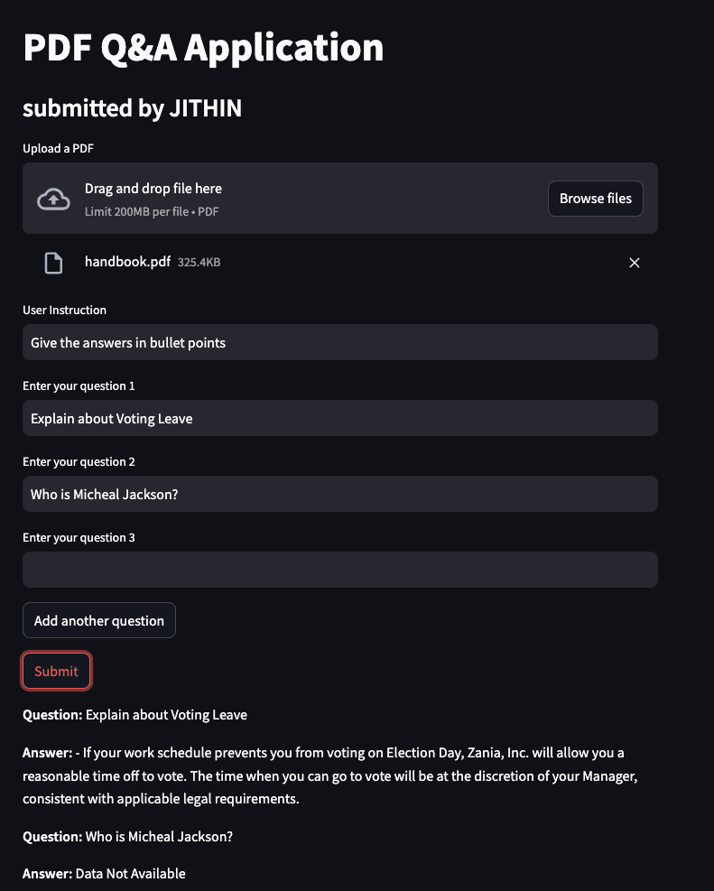

# PDF Q&A Application

## Overview

The PDF Q&A Application is a tool that allows users to upload a PDF document, ask questions about its content, and receive answers generated by an AI model. This application leverages the power of OpenAI's language models to provide accurate and relevant answers based on the content of the uploaded PDF. This is hosted as a Streamlit application.

## Access the Application

This app is hosted on HuggingFace Spaces. You can access it [here](https://huggingface.co/spaces/JithinVijayDazz/pdf-qna).

## Screenshot

## Features

- **PDF Upload**: Users can upload a PDF document.
- **Question Input**: Users can input multiple questions about the PDF content.
- **Custom Instructions**: Users can provide custom instructions for how the answers should be formatted.
- **Parallel Processing**: Questions are processed in parallel for faster response times.
- **Confidence Scoring**: Answers are evaluated for confidence.
